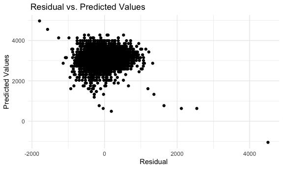
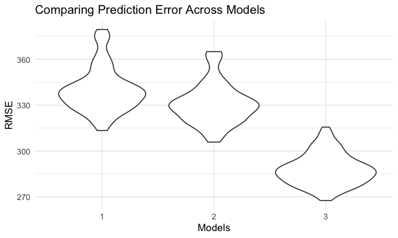

P8105\_HW6
================

## Problem 1

Import the data and clean the data by checking missing data and convert
numeric variables into factor.

``` r
birth_w = read_csv("./birthweight.csv") %>% 
  janitor::clean_names() %>% 
  mutate(
        babysex = factor(babysex),
        babysex = fct_recode(babysex,"Male"="1", "Female"= "2"),
        frace =factor(frace),
        frace = fct_recode(frace,"White"="1","Black"="2","Asian"="3","Puerto Rican" = "4","Other"="8","Unknown"="9"),
        malform =factor(malform),
        malform =fct_recode(malform,"absent"="0","present"="1"),
        mrace=factor(mrace),
        mrace = fct_recode(mrace,"White"="1","Black"="2","Asian"="3","Puerto Rican" = "4","Other"="8")) %>% 
  na.omit()
```

**Propose a regression model for birth weight and make a plot of model
residuals against fitted values.**

I am interested in examining the linear association between baby’s
length at birth and baby’s birth weight. Thus, I use `lm` function
begins with the formula specification. The predictor is baby’s length at
birth and the outcome is baby’s birth weight. Then I tidy up my result.I
also make a plot for residual against predict value based on my proposed
model. According to the graph below, we can see that the residuals are
around 0.

``` r
rl = lm(bwt ~ blength,data = birth_w) 
      
rl %>% 
    broom::tidy() %>% 
    select(term, estimate, p.value) %>% 
    mutate(term = str_replace(term, "blength", "Birth_Length")) %>% 
    knitr::kable(digits = 3)
```

| term          |  estimate | p.value |
|:--------------|----------:|--------:|
| (Intercept)   | -3841.267 |       0 |
| Birth\_Length |   139.811 |       0 |

``` r
birth_w%>% 
    modelr::add_predictions(rl) %>% 
    modelr::add_residuals(rl) %>% 
    ggplot(aes(x=resid,y=pred))+ 
    geom_point()+
    labs(
     x="Residual",
     y="Predicted Values",
     title =" Residual vs. Predicted Values")
```



#### Compare the models

Model\_1 uses length at birth as predictor. Model\_2 uses length at
birth and gestational age as predictors. Model\_3 uses head
circumference, length, sex, and all interactions (including the
three-way interaction) between these.

``` r
bw_df = 
  crossv_mc(birth_w, 100) %>% 
  mutate(
    train = map(train, as_tibble),
    test = map(test, as_tibble)) %>% 
 mutate(
    mod_1 = map(train, ~lm(bwt ~ blength, data = .x)),
    mod_2   = map(train, ~lm(bwt ~ blength+gaweeks, data = .x)),
    mod_3  = map(train, ~lm( bwt~ blength*babysex+bhead*babysex+bhead*blength+bhead*babysex*blength, data = .x))) %>% 
  mutate(
    rmse_1 = map2_dbl(mod_1, test, ~rmse(model = .x, data = .y)),
    rmse_2 = map2_dbl(mod_2, test, ~rmse(model = .x, data = .y)),
    rmse_3 = map2_dbl(mod_3, test, ~rmse(model = .x, data = .y)))

bw_df %>% 
  select(starts_with("rmse")) %>% 
  pivot_longer(
    everything(),
    names_to = "model", 
    values_to = "rmse",
    names_prefix = "rmse_") %>% 
  mutate(model = fct_inorder(model)) %>% 
  ggplot(aes(x = model, y = rmse)) +
  geom_violin()+
  labs(
    title = "Comparing Prediction Error Across Models",
    x = "Models",
    y = "RMSE")
```



## Problem 2

``` r
weather_df = 
  rnoaa::meteo_pull_monitors(
    c("USW00094728"),
    var = c("PRCP", "TMIN", "TMAX"), 
    date_min = "2017-01-01",
    date_max = "2017-12-31") %>%
  mutate(
    name = recode(id, USW00094728 = "CentralPark_NY"),
    tmin = tmin / 10,
    tmax = tmax / 10) %>%
  select(name, id, everything())
```
