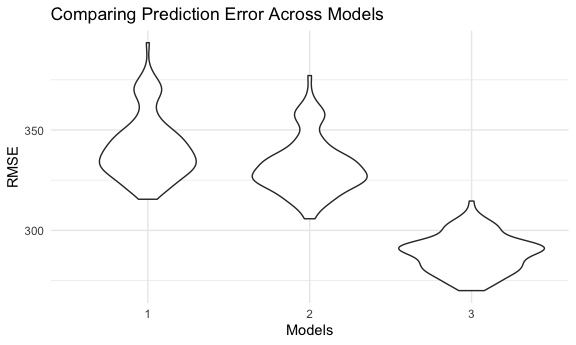

Linear Regression
================

## Problem 1

``` r
birth_w = read_csv("./birthweight.csv") %>% 
  janitor::clean_names() %>% 
  mutate(
        babysex = factor(babysex),
        babysex = fct_recode(babysex,"Male"="1", "Female"= "2"),
        frace =factor(frace),
        frace = fct_recode(frace,"White"="1","Black"="2","Asian"="3","Puerto Rican" = "4","Other"="8","Unknown"="9"),
        malform =factor(malform),
        malform =fct_recode(malform,"absent"="0","present"="1"),
        mrace=factor(mrace),
        mrace = fct_recode(mrace,"White"="1","Black"="2","Asian"="3","Puerto Rican" = "4","Other"="8")) %>% 
  na.omit()
```

    ## Rows: 4342 Columns: 20

    ## ── Column specification ────────────────────────────────────────────────────────
    ## Delimiter: ","
    ## dbl (20): babysex, bhead, blength, bwt, delwt, fincome, frace, gaweeks, malf...

    ## 
    ## ℹ Use `spec()` to retrieve the full column specification for this data.
    ## ℹ Specify the column types or set `show_col_types = FALSE` to quiet this message.

``` r
rl = lm(bwt~blength,data = birth_w)

birth_w %>% 
  modelr::add_predictions(rl) %>% 
  ggplot(aes(x = pred, y = bwt)) + geom_point()+
  labs(
     x="Predicted Values",
     y="Actual Values",
     title =" Predicted vs. Actual Values")
```


``` r
birth_w %>% 
  modelr::add_residuals(rl) %>% 
  ggplot(aes(x = blength, y = resid)) + geom_point()
```


#### using length at birth and gestational age as predictors

``` r
fit = lm(bwt ~ blength + gaweeks, data = birth_w)
fit %>% 
  broom::tidy()
```

    ## # A tibble: 3 × 5
    ##   term        estimate std.error statistic  p.value
    ##   <chr>          <dbl>     <dbl>     <dbl>    <dbl>
    ## 1 (Intercept)  -4348.      98.0      -44.4 0       
    ## 2 blength        129.       1.99      64.6 0       
    ## 3 gaweeks         27.0      1.72      15.7 2.36e-54

``` r
birth_w %>% 
  modelr::add_residuals(fit) %>% 
  ggplot(aes(x=blength,y=resid))+
  geom_point()
```



``` r
birth_w %>% 
  modelr::add_residuals(fit) %>% 
  ggplot(aes(x=gaweeks,y=resid))+
  geom_point()+
  facet_wrap(.~blength)
```


## Problem 2

``` r
weather_df = 
  rnoaa::meteo_pull_monitors(
    c("USW00094728"),
    var = c("PRCP", "TMIN", "TMAX"), 
    date_min = "2017-01-01",
    date_max = "2017-12-31") %>%
  mutate(
    name = recode(id, USW00094728 = "CentralPark_NY"),
    tmin = tmin / 10,
    tmax = tmax / 10) %>%
  select(name, id, everything())
```

    ## Registered S3 method overwritten by 'hoardr':
    ##   method           from
    ##   print.cache_info httr

    ## using cached file: ~/Library/Caches/R/noaa_ghcnd/USW00094728.dly

    ## date created (size, mb): 2021-10-17 19:22:04 (7.605)

    ## file min/max dates: 1869-01-01 / 2021-10-31
